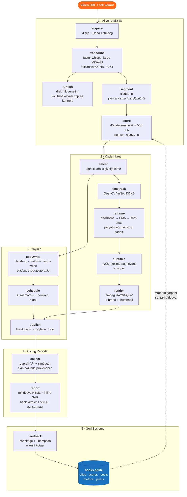

# Mimari

Tek komut, 13 aşama, hiçbir aşamada manuel müdahale yok.

```bash
yvc run "https://www.youtube.com/watch?v=r39OrneyMDs"
```

---

## Veri akışı ve araç haritası



---

## Her aşamada ne kullanılıyor

| # | Aşama | Araç / Model | Çıktı | Neden bu araç? |
|---|---|---|---|---|
| 1 | acquire | `yt-dlp` + **Deno** + `ffmpeg` | `source.mp4`, `audio16k_raw.wav` | Deno olmadan n-signature challenge çözülmez ve YouTube sessizce sadece 360p listeler |
| 2 | transcribe | **faster-whisper** (CTranslate2 int8) | `transcript.json` (kelime-seviyesi) | GPU yok, 7.7GB RAM → torch dışlandı. Kelime timestamp'i karaoke altyazı için zorunlu |
| 3 | turkish | saf Python + `yt-dlp` altyazı | `quality_report.json` | Diakritik yoğunluğu ölçülür, iddia edilmez |
| 4 | segment | **`claude -p`** (subprocess) | `segments.json` | API key yok; CLI OAuth'lu. Model yalnızca id döndürür |
| 5 | score | `numpy` + **`claude -p`** | `scores.json` | Enerji/perde/hız koddan; yargı LLM'den. İkisi bağımsız |
| 6 | select | saf Python (DP) | `clips.json` | Ağırlıklı aralık çizelgeleme — greedy değil, optimal |
| 7 | render | **OpenCV YuNet** + `ffmpeg` | `clips/*.mp4`, `cover.jpg` | YuNet 232KB, mediapipe'ın protobuf çakışması yok |
| 8 | copywrite | **`claude -p`** | `posts.json` | Klip başına tek çağrı, tüm platformlar |
| 9 | schedule | kural tablosu (`scheduling.yaml`) | `schedule.json` | Gerekçe veri alanı, hardcoded string değil |
| 10 | publish | adapter katmanı | `publish/**/*.json`, `curl.sh` | `build_calls()` saf ve paylaşılan → dry-run == canlı payload |
| 11 | collect | simülatör (+ gerçek API yeri hazır) | `metrics.json` | Her alan `REAL`/`SIMULATED` etiketli |
| 12 | report | `jinja2` yok — saf Python + inline SVG | `report.html` | CDN yok, JS yok, offline açılır |
| 13 | feedback | saf Python + **SQLite** | `feedback.json`, `hooks.sqlite` | Kimlik bilgisi gerekmez → klonla-çalıştır kuralı korunur |

---

## Çalıştırılabilirlik ve resume

Her aşama bir **fingerprint** kaydeder:

```
fingerprint(stage) = sha256(
    stage.version │ okuduğu config alt ağacı │ bağımlılıklarının fingerprint'leri
)
```

Aşama yalnızca fingerprint aynıysa **ve** çıktıları diskte varsa atlanır.

- `yvc run <url>` iki kez → ikincisi hiçbir gereksiz iş yapmaz
- `config.yaml`'da copywriting ağırlığı değişti → `copywrite` ve sonrası yeniden çalışır, **1 saatlik transkripsiyon dokunulmaz**
- Transkripsiyon çökerse → `transcript.partial.jsonl`'dan devam, en fazla ~40 sn ses kaybı
- Tek klip render'ı patlarsa → diğerleri üretilir, hata `render.json`'a yazılır

---

## Kritik tasarım kararları

**LLM asla zaman damgası üretmez.** Cümle sınırları deterministik olarak
numaralandırılır; model yalnızca integer id döndürür. Aday setinde olmayan id
reddedilir. Sınır, yapı gereği kelime başlangıcıdır — halüsinasyon timestamp'in
kelime ortasına düşmesi imkânsız.

**`build_calls()` saf ve paylaşılan.** `DryRunAdapter` = `build_calls()` + diske yaz.
`LiveAdapter` = `build_calls()` + `execute()`. Dry-run çıktısı, gönderilecek
byte'ların birebir kendisi — mock değil. Contract testleri bu eşitliği pinliyor.

**`format=yuv420p` filtre zincirinin SONUNDA.** `ass` ve `overlay` piksel formatını
yeniden pazarlık edip yuv444p'ye yükseltiyor; 4:4:4 H.264'ü hiçbir platform kabul etmez.

**ffmpeg klip klasöründe çalışır.** `sub.ass` ve `fonts` çıplak göreli isimlerle
referans verilir → Windows sürücü-harfi escape cehennemi (`C\:/path`) hiç ortaya çıkmaz.

**Geri besleme çarpanı `[0.80, 1.25]` ile sınırlı.** Kanıtlanmış bir hook tipi bile
en fazla +%25 alır; gerçekten iyi bir klip "kaybeden" tiple bile kazanabilir.
Öğrenilen sinyal sıralamayı **eğer, dikte etmez.**
